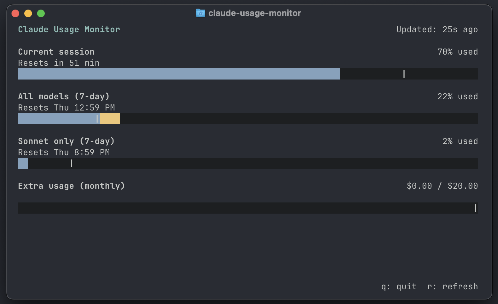

# claude-usage-monitor

A terminal UI for monitoring Claude plan usage limits in real-time.



## Description

`claude-usage-monitor` is a single-file Python curses TUI that displays your Claude usage limits with visual progress bars and glide slope indicators. It shows both session (5-hour) and weekly (7-day) usage windows, helping you track your Claude Pro/Max consumption.

The glide slope indicator compares your actual usage against the ideal pace based on elapsed time in each window. Blue means you're under the ideal rate, yellow means you're over.

## Features

- Real-time usage monitoring with colored progress bars
- Glide slope indicators for session and weekly limits
- Paid overage (extra usage) tracking if enabled
- Smart auto-refresh: 30 seconds when terminal is focused, 10 minutes when unfocused
- Manual refresh with `r`, quit with `q`
- No external dependencies beyond Python standard library

## Requirements

- macOS (reads Claude Code OAuth token from macOS Keychain)
- Python 3.7+
- Active Claude Pro or Max subscription with Claude Code enabled

## Installation

Install directly from GitHub:

```bash
pip install git+https://github.com/alliprice/claude-usage-curses.git
```

Or clone and install locally:

```bash
git clone https://github.com/alliprice/claude-usage-curses.git
cd claude-usage-curses
pip install .
```

## Usage

```bash
claude-usage-monitor
```

Controls:
- `r` - Refresh usage data immediately
- `t` - Set custom refresh interval (in seconds)
- `q` - Quit

The display automatically refreshes every 30 seconds when the terminal is focused, or every 10 minutes when unfocused. The UI adapts to small terminals, scaling down to just two progress bars in a 2-line window.

## License

MIT License - see LICENSE file for details.
